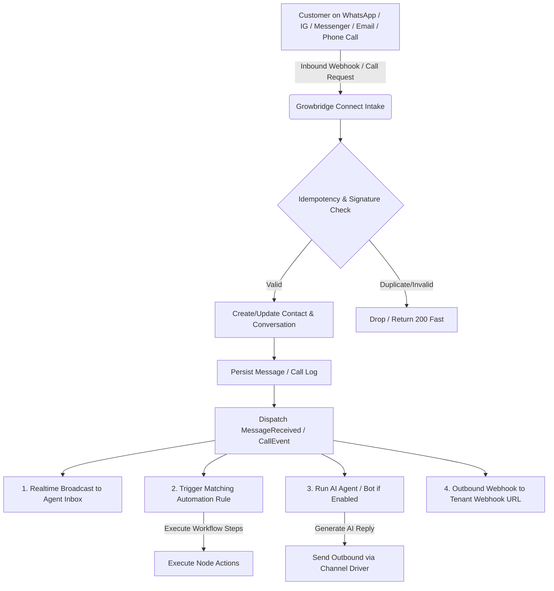

# GROWBRIDGE CONNECT — SYSTEM ARCHITECTURE

## 1. High-Level Architectural Overview

GROWBRIDGE CONNECT is designed as a **Lightweight, High-Performance Omnichannel Communication, AI Automation, and AI Voice Agent Platform** tailored for seamless operation on standard hosting environments (cPanel, Apache, PHP 8.2+, MySQL) while retaining enterprise-grade reliability and modularity.

```
+-----------------------------------------------------------------------------------+
|                                 CLIENT CLIENTS                                    |
|   Web App (connect.growbridge.co.in)  |  Mobile App (iOS/Android) |  External API |
+-----------------------------------------------------------------------------------+
                                         |
                                         v
+-----------------------------------------------------------------------------------+
|                        GROWBRIDGE CONNECT REST API & SPA                          |
|                       (api.connect.growbridge.co.in)                              |
+-----------------------------------------------------------------------------------+
|  [HTTP Layer]                                                                     |
|    - Sanctum Token Auth / Session Auth                                            |
|    - Rate Limiting & Webhook Signature Guards                                     |
|    - Inertia.js React 19 Frontend Bridge                                          |
|                                                                                   |
|  [Core Application Modules]                                                       |
|    - Unified Inbox (WhatsApp Cloud API, Messenger, Instagram, Email)              |
|    - AI Agents & RAG Engine (OpenAI, Gemini, Anthropic)                           |
|    - AI Voice Agents (Telephony Abstraction: Exotel, Twilio, Plivo)               |
|    - Visual Automation Engine (Event triggers, Conditions, Actions, Delays)       |
|    - Omnichannel Broadcasting (WhatsApp Templates, Multi-gateway SMS, SMTP Email) |
|    - Lightweight CRM (Contacts, Segments, Lead Pipelines, Activity History)       |
|    - Developer API (/api/v1/) & Outbound Webhook Subsystem                        |
|                                                                                   |
|  [Asynchronous Job Queue & Scheduler]                                             |
|    - Laravel Database Queue (Zero external broker required)                       |
|    - Laravel Cron Scheduler (php artisan schedule:run)                            |
+-----------------------------------------------------------------------------------+
                                         |
                                         v
+-----------------------------------------------------------------------------------+
|                               PERSISTENCE & STORAGE                               |
|   MySQL 8.0+ / MariaDB 10.4+  |  Local Storage / S3 / Cloudflare R2 Cloud Storage |
+-----------------------------------------------------------------------------------+
```

---

## 2. Layered Architecture & Separation of Concerns

### A. Presentation & Frontend Layer
- **Technology:** React 19, Inertia.js v2, TailwindCSS with CSS custom properties.
- **Role:** Render modern, high-speed, dynamic interfaces with zero direct database exposure.
- **Routing & Navigation:** Clean, unencumbered 10-item core navigation:
  1. `Dashboard`
  2. `Inbox`
  3. `Contacts` (CRM)
  4. `Campaigns`
  5. `Automation`
  6. `AI Agents`
  7. `Voice Agents`
  8. `Analytics`
  9. `Integrations`
  10. `Settings`

### B. Business Logic & Domain Modules (`app/Modules/`)
- Encapsulated modules with independent ServiceProviders, Models, Controllers, Services, and Migrations:
  - **Shared Module:** Core domain entities (`Contact`, `Conversation`, `Message`, `ChannelAccount`).
  - **Whatsapp Module:** Dedicated WhatsApp Cloud API driver, template synchronizer, and webhooks.
  - **Inbox Module:** Multi-channel inbox router, canned replies, labels, internal team notes.
  - **AI Module:** LLM gateway, document indexing, chunk embeddings, multi-turn chatbot execution.
  - **Voice Module (New):** Voice agent configuration, telephony provider bridge (Exotel, Twilio, Plivo), call tracking, AI transcription summaries, and automated webhook dispatch.
  - **Automation Module:** Event listeners, graph traversal engine, conditional evaluation, and step dispatch.
  - **Broadcasting Module:** Campaign dispatchers, SMS provider registry (15+ drivers), SMTP mail sender, open/click trackers.
  - **Leads Module:** Google Places scraper, sales pipeline Kanban, activity timeline, lead scoring.
  - **Integrations Module:** Centralized credential resolver with encryption, connection health test harness, and audit logger.

### C. Data & Infrastructure Layer
- **Multi-Tenancy:** Workspace-scoped single-database tenancy. Every tenant record is indexed on `workspace_id`.
- **Database Engine:** MySQL / MariaDB using standard InnoDB transactional storage with full foreign key constraints and covering composite indexes.
- **Queue Worker:** Database queue driver executing on background CLI workers or cron-triggered queue runners.
- **Storage:** Pluggable local disk or S3/R2 storage via Flysystem.

---

## 3. Communication Channels & Omnichannel Pipeline



---

## 4. AI Voice Agents Architecture

To maintain compatibility with cPanel without running complex Node.js/Python or GPU daemons on the application server, GROWBRIDGE CONNECT adopts an **Orchestrated Telephony Integration Model**:

1. **Agent Setup:** User configures Voice Agent in Growbridge Connect (Language, Tone, System Prompts, Knowledge Base, Working Hours, Human Transfer Number, Provider).
2. **Provider Bridge:** Telephony requests (Inbound Webhooks / Outbound Click-to-Call) communicate with external telephony APIs (Exotel, Twilio, Plivo) via standard REST webhooks.
3. **Call Lifecycle:**
   - Inbound call arrives at provider number -> Provider triggers Growbridge webhook.
   - Growbridge validates workspace routing and returns IVR / Voice AI instructions or connects to voice assistant stream.
   - Upon call completion, provider posts Call Detail Records (CDR), duration, recording URL, and transcript.
   - Growbridge processes call summary using configured LLM, logs to Contact Activity Timeline, updates Lead score/status, and fires `call.completed` automation trigger.

---

## 5. Deployment Topology & Lightweight Hosting

```
+-------------------------------------------------------------+
|               cPanel / Linux VPS / Cloud Server             |
|                                                             |
|   +-----------------------+     +-----------------------+   |
|   | Apache / Nginx        |     | PHP 8.2+ (OPcache)    |   |
|   | (SSL / Reverse Proxy) | --> | (FPM / FastCGI)       |   |
|   +-----------------------+     +-----------------------+   |
|                                             |               |
|                                             v               |
|                                 +-----------------------+   |
|                                 | MySQL / MariaDB       |   |
|                                 +-----------------------+   |
|                                             ^               |
|                                             |               |
|   +-----------------------------------------------------+   |
|   | cPanel Standard Cron:                               |   |
|   | * * * * * php artisan schedule:run                  |   |
|   | * * * * * php artisan queue:work --stop-when-empty  |   |
|   +-----------------------------------------------------+   |
+-------------------------------------------------------------+
```

Growbridge Connect operates with 100% feature availability under this architecture without requiring any proprietary cluster infrastructure.
